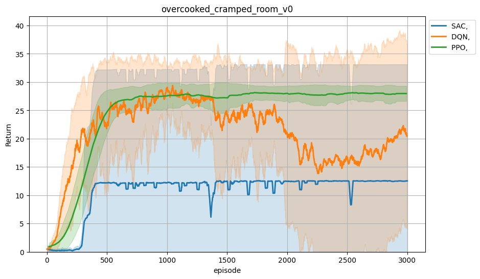
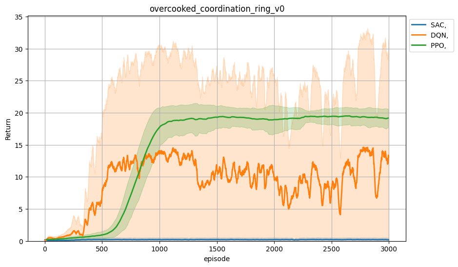
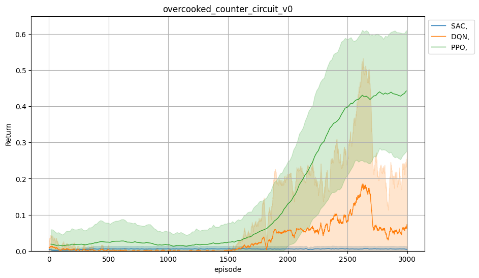
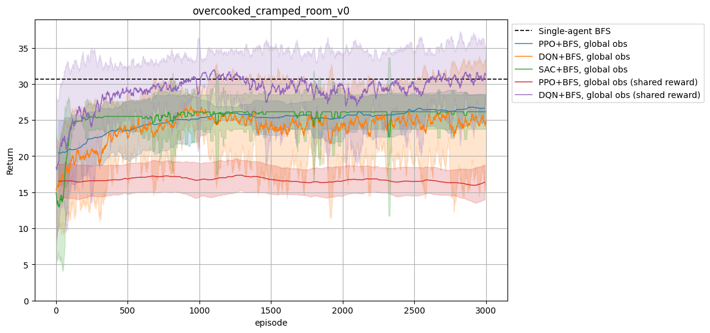
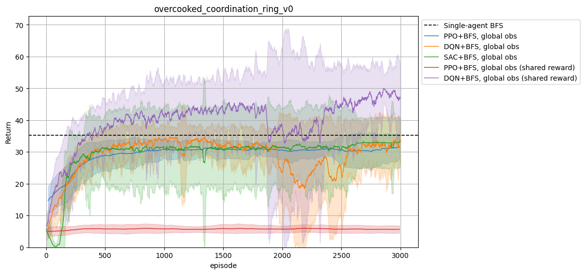
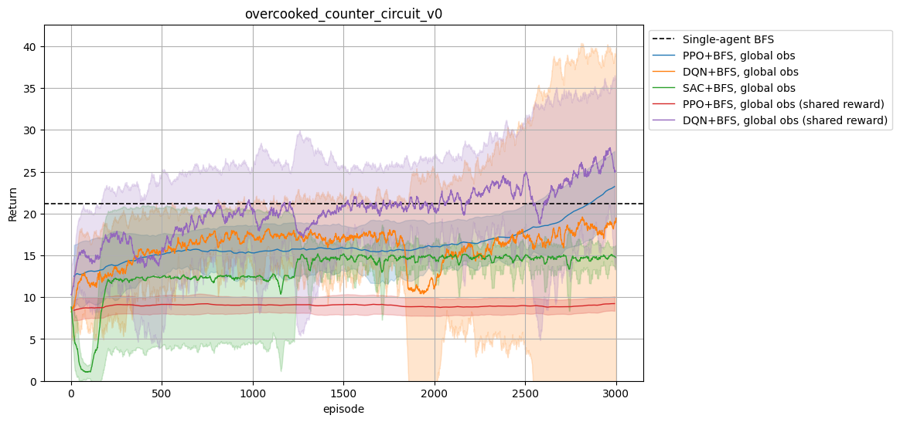
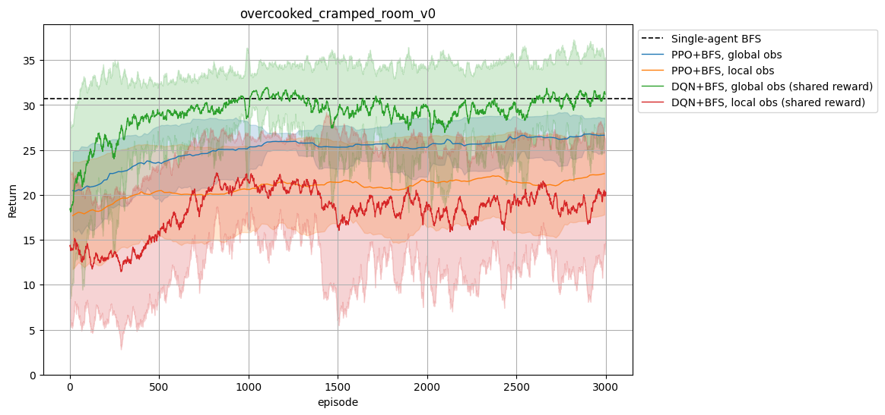
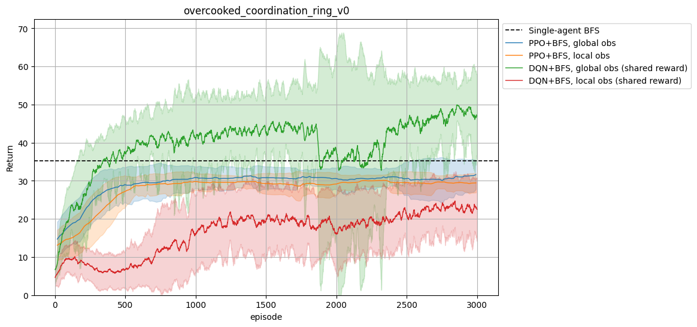
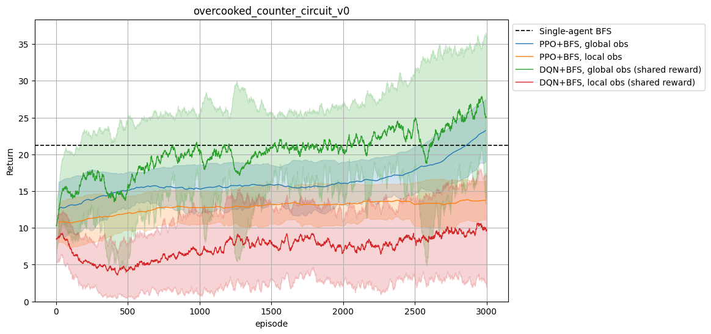

# Documentation
This file contains the documentation of the code produced by Logan Woudstra for the CMPUT 499 individual research course completed during the Winter 2026 semester.
The goal of this course was to benchmark the performance of different RL algorithms and observation spaces to facilitate sample-efficent learning in the Overcooked AI environment.

## Installation
Follow the installation guide in README.md to install the nessecary libraries and to set up Compute Canada.
Ensure that the version of cogrid installed is 0.0.16, as later versions use a different Overcooked oberservation space (this version is specified in requirements.txt, so you shouldn't have to worry about it, but you can double-check just to be sure).

## Training an Agent
Review README.md to understand how to train an agent and the different arguments you can specify (number of agents, number of environments, layout, obervation space, etc.).
However, that document mainly covers working with PPO (mappo), so we shall give information about the SAC and DQN implmentations we added.

## Algorithms
To change the algorithm, use the ```--algorithm [sac, dqn, ppo, bfs]``` arg for main.py.
As well, each algoritihm has parameters specific to itself that you should declare.
### SAC
We found SAC to be very sensitive to hyperparameter selection.
After doing an (non-comprehensive) sweep of the parameter space, we find the following values to yield the best SAC performance (Note: SAC requires exactly 1 environment).

```
--algorithm sac
--num-envs 1
--num-steps 1 
--batch-size-sac 128 
--gamma 0.99 
--lr 3e-5 
--buffer-size 500_000 
--hidden-dim 256 
--tau 0.01 
--grad-norm-clip 10.0 
--anneal-scale 0.1
```

### DQN
For DQN, these are the parameters we found to work best. (Note: DQN requires exactly 1 environment).
```
--algorithm dqn 
--num-envs 1
--num-steps 1
--batch-size-sac 128 
--gamma 0.99
--lr 3e-5
--buffer-size 500_000 
--hidden-dim 256
--tau 0.01
--grad-norm-clip 10.0
--anneal-scale 0.1
```

### PPO
For PPO, these are the parameters we found to work best.
```
--algorithm mappo
--num-steps 128
--num-minibatches 4
--ppo-epoch 5 
--clip-param 0.2
--value-loss-coef 0.5 
--entropy-coef 0.01
--gamma 0.99
--lam 0.95
--max-grad-norm 0.5 
--lr 3e-4
```

### BFS
This is a naive/greedy agent that chooses a target from a fixed list conditioned on the environment state.
From this target, the action to take to navigate the grid-world is found using Breadth-First Search (BFS).
Note that this agent does not consider the position of its partners, as these change dynamically.
Therefore, trainable agents must learn to move out of the way of the BFS and complement this fixed strategy.
A BFS agent has no algorithm-specific arguments.


## Training with a BFS partner
In this course, we trained agents to work with the BFS agent described above.
To train an agent with this partner, use the ```--fixed-bfs``` arg and set ```--num-agents``` to be an interger greater than 1. We only ever used ```--num-agents 2``` (i.e. learning a single agent to work with a BFS partner).

## Training on Compute Canada
Training RL agents is computationally expensive, so we use the compute capabilites of Compute Canada (CC).
To train an agent, you can use the bash scripts in the "scripts" folder. 
For example, to train a DQN agent with a BFS partner using the parameters specified above, you can run the following command on CC:
```
sbatch scripts/CC_script_dqn.sh 128 10_000_000 1 0.99 3e-5 500_000 256 0.01 10.0 0.1 data/dqn_bfs_cramped_room/1 overcooked_cramped_room_v0 global_obs 1
```

If you want to schedule mutiple jobs to run different seeds/maps, then you can using the ```scripts/[ALGORITHM]_seeds.sh``` files.
In the header of these files, you can specify whether to use global or local observations, and whether or not to train with a BFS partner.
Currently, these scripts only support learning a single agent, so if no BFS partner not is selected (i.e. ```FIXED_BFS=0```) then only only there is only 1 agent in the environment, and if a BFS partner is selected (i.e. ```FIXED_BFS=1```) then there are 2 agents in the environment (the BFS and the chosen algorithm).
For example, to train a SAC agent across 3 maps (cramped roon, counter circuit, and coordination ring) with 5 seeds per map, you can run the following command on CC:
```
bash scripts/sac_seeds.sh
```

## Visualizing Learned Policies
After training an agent, you can visualize the learned policy using the following code:
```
python -m tests.test_load --model-path .\models\[MODEL_PATH].pth --layout [LAYOUT] --num-agents [NUM_AGENTS] --algorithm [ALGORITHM] --fixed-bfs
```

__IMPORTANT:__ Ensure that you specify the following arguments to be the same as was used in training: map layout, number of agents, algorithm, and whether there was a BFS partner.

## Plotting Results
To plot results across multiple different configuration, you can use the following code where you specify the folders that contain data for each configuration:
```
python3 plot.py --folders .\data\_final\ppo_bfs_coordination_ring_global_obs\combined\ .\data\_final\dqn_bfs_coordination_ring_global_obs_long\combined\ .\data\_final\sac_bfs_coordination_ring_global_obs\combined\ .\data\_final\ppo_bfs_shared_coordination_ring_global_obs\combined\ .\data\_final\dqn_bfs_shared_coordination_ring_global_obs\combined\  --keyword {returns, delivery, pot} 
```
If you have runs across multiple seeds for a single configuration, to get the mean and 95% confidence interval ensure that all data is in a single folder (for example, the 'combined' folders above each contain results for 5 seeds).

## Experiments and Results
In this course, we performed various experiments to benchmark the impact of different design decisions.
We report the main findings here.
### Single-Agent
We find that SAC struggles to learn in most seeds, only seeing success in 2 out of 5 seeds on cramped room.
However, on those seeds in which it does succeed, it learns much faster that PPO (converges in about half the number of steps).
Overall, PPO is the most consistent algorithm and achieves the highest return by the end of training.




### BFS Partner and Reward Distribution
We find that in this setting, DQN outperforms PPO, achieving the highest average return across all 3 maps.
Interestingly, we also see that the chosen reward distribution makes a signifigant difference, with PPO perfoming better with the default rewards, and DQN performing better with shared rewards.




### Observation Space
We find that the chosen observation space also makes a big difference.
Using a local observation is worse at every point in time, and does not lead to faster initial learning at the cost of a lower converged return (as we originally hypothesized).
As well, PPO can handle the local observation better than DQN, seeing a less drastic drop in performance when switching to this new observation space.


